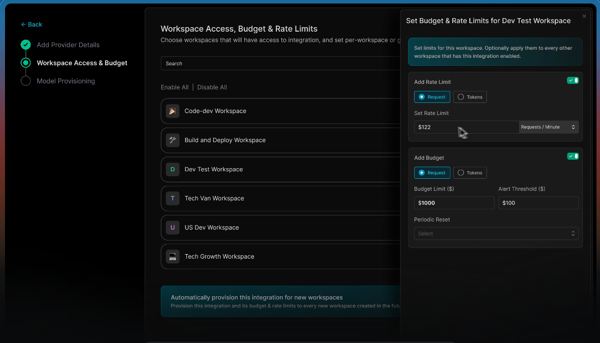

# Nebari Gateway Console — User Stories & Requirements

> Working worksheet. Check off requirements as they're built; drop in notes and
> reference-site ideas as you browse. Distilled from [`docs/plan.md`](./plan.md)
> (§3 users, §4 requirements, §6 flows) — that stays the fuller source.

**How to read the tags:** every requirement ends with `→ Surface · Phase`, i.e. *where
the story lives* in the app and *when* it's realistic.

- **Surfaces:** Overview · Traffic · Receipt (drawer) · Spend · Guardrails · Configure · Operate
- **Phases:** `P1` Observe *(us — now)* · `P2` Configure · `P3` Enforce · `P4` Optimize

**The shared atom:** all three personas read the **same request stream** through the
**Receipt**. Infra reads it for the trace, Finance for the cost, Security for the verdict.
Get the receipt right and each persona's view is a projection of the same object.

---

## 👤 Platform / Infra Engineer — *Phase 1 primary persona*

**Job:** *"Keep it up, route it right, debug the bad call."*
**Signature flow:** Overview (spot it) → Traffic (filter to it) → Receipt (read the trace).
**Success signal:** *"I'd rather debug here than in `kubectl logs`."*

### What they need
- [ ] Gateway health at a glance — up/down, error rate, failover state → *Overview · P1*
- [ ] "Needs attention" list — current problems surfaced, not hunted for → *Overview · P1*
- [ ] "What changed" — a config change joined to its traffic effect → *Overview · P1*
- [x] Dense live request stream — time, key, model, tokens, cost, latency, verdict → *Traffic · P1*
- [x] Filter the stream to a failing slice — verdict / model (+ free-text search); **+ time** now via the shared global time-range control → *Traffic · P1*
- [x] Filters serialize to the URL — shareable, linkable → *Traffic · P1*
- [x] "Live but calm" — rows settle in place, freeze-on-hover, no focus-steal → *Traffic · P1*
- [x] Open any request's full **decision trace** → *Receipt · P1* *(drawer built S1; now URL-addressable `?receipt=`)*
- [x] See *where* it stopped/slowed — identity → budget → rules → route → upstream → response → *Receipt · P1*
- [ ] Correlate "route changed 2:14pm" to the resulting failures → *Overview / Receipt · P1*

### 💬 Notes & reference ideas
<!-- Sites I liked, patterns to steal, questions. e.g. "Helicone request-log → detail flow" -->
-

---

## 👤 Finance / FinOps — *Phase 1 read-only; enforcement lands P2/P4*

**Job:** *"Know where the money went, and cap it."*
**Signature flow:** Spend (break down) → spot outlier → drill to Traffic → (later) set a budget.
**Success signal:** *A budget set in the UI actually stops spend.*

### What they need
- [ ] Total spend with trend — requests / $ / blocked, moving over time → *Overview / Spend · P1*
- [ ] Cost attribution — break down by team / project / key / model / provider → *Spend · P1*
- [ ] Spot the outlier — sort a breakdown by cost → *Spend · P1*
- [ ] Drill a spend row into a filtered Traffic view for that slice → *Spend → Traffic · P1*
- [ ] Projection to period-end — with a **stated basis**, not a mystery number → *Spend · P1*
- [ ] "Who's near the cap" — budget bar + enforcement badge → *Spend · P1 view / P4 enforce*
- [ ] Set/adjust a budget with a real enforcement action (warn/throttle/block) → *Configure / Optimize · P2/P4*
- [ ] Export the numbers — CSV / PDF for reporting up → *Spend · P4*

### 💬 Notes & reference ideas
<!-- e.g. "Gate.AI financial-management dashboard", "OpenRouter per-model activity page" -->
-

---

## 👤 Security / Compliance — *Phase 1 read-only; authoring/replay lands P3*

**Job:** *"Prove what left the perimeter."*
**Signature flow:** Traffic (redacted+blocked slice) → Receipt (verdict) → (later) author + replay a rule.
**Success signal:** *A non-engineer authors, replays, and promotes a redaction rule with confidence.*

### What they need
- [x] Filter traffic to the egress-relevant slice — `redacted` + `blocked` → *Traffic · P1* *(multi-verdict filter)*
- [x] Per-request verdict + redaction summary — **type + count only, never content** → *Receipt · P1*
- [ ] Read which rule fired, and in what mode (monitor vs enforce) → *Receipt · P1 view / P3 rules*
- [x] Every block for a given key, on demand → *Traffic · P1* *(verdict=blocked + search-by-key, URL-shareable)*
- [ ] Tamper-evident receipts + provenance — evidence an auditor trusts → *Receipt · P3+*
- [ ] Author a redaction rule → *Guardrails · P3*
- [ ] **Replay** a rule against recorded traffic, see the diff, then promote → *Guardrails · P3*

### 💬 Notes & reference ideas
<!-- e.g. "trace-detail view from Langfuse", "how X shows a redaction without leaking it" -->
-

---

## 🌐 Cross-cutting — every screen

Global scaffolding all three personas rely on (from plan §5).

- [ ] Environment switcher — prod vs staging, distinct accent → *global*
- [x] Time-range control — **shared state** across Overview / Traffic / Spend → *global · P1* *(URL-canonical presets 1h/6h/24h/7d/30d + custom absolute pin; live-slides when relative, kills auto-refresh when pinned; wired to scope all three Observe surfaces. Spend billing-boundary snap still deferred.)*
- [ ] Command palette (⌘K) — jump to a key / model / rule / trace id → *global · P1*
- [ ] Degradation banner — pipeline stale / control plane down / fail-open / failover → *global · P1*
- [ ] Every number drills to the receipts behind it → *global · P1*
- [ ] Verdict never by color alone — glyph + text label (WCAG 2.2 AA) → *global · P1*

### 💬 Notes & reference ideas
-

---

## 📥 Reference-site inbox

As you browse similar consoles, drop finds here, then move them up into the relevant
persona above. (See `plan.md` appendix / prior research: Gate.AI, Portkey, Helicone,
LiteLLM, Cloudflare AI Gateway, Vercel AI Gateway, Langfuse; plus Stripe & Grafana for feel.)

| Site | What I liked | Fits persona / surface | Comment |
|---|---|---|---|
|  |  |  |  |
|  |  |  |  |
|  |  |  |  |
 I like add a provider you can see the flow set up parts like how this is on the left and it's all configured.

I forgot to mention that you'll probably want to connect to local models when developing. If you have something like ollama, llama.cpp, docker, etc runnign locally you should be able to do that over its standard openai url. Here are a few of the options that gate.dev provides. I would also include OpenRouter.

good examples from gate.dev

---

## ❓ Open questions carried from `plan.md` §7

Decisions that shape these stories — worth resolving as the flows firm up.

- [x] Density default & switching — **Decided:** dense-by-default for Traffic; density is a **global** user preference (comfortable/compact/dense), persisted, with sensible per-surface starting defaults (Traffic dense; Overview/Spend comfortable). Not per-table.
- [x] Receipt: drawer only, or full page? — **Decided:** both, rendering the **same `<Receipt>` component** in two frames. P1: build the drawer and make it **URL-addressable** (`?receipt=<id>` pushed onto the current screen) so a quick peek is already shareable. Full standalone page (`/receipt/:id`, printable, for auditors/cold links) is a later trivial add reusing the same component; drawer gets an "expand ⤢" affordance to promote a peek to it.
- [x] "Live but calm" mechanics — **Decided:** (a) rows **top-insert, newest-first**, animating in by expanding their own height (~150ms, rows slide not jump) with a faint entry tint that fades ~1s; **batch** multiple arrivals into one tint, never N animations. (b) **Poll on an interval for P1** (trivial against mock data, natural batching), behind a swappable "rows since cursor X" hook so SSE/WebSocket streaming is a later drop-in, not a rewrite. (c) **Freeze-on-hover:** hovering the table body / focusing a row / opening the receipt drawer pauses insertion; queued rows show as a **"N new" pill** at the top; un-hover or click-pill flushes them in with the batched tint. Never steals focus on new rows (a11y).
- [x] Time-range shared state — **Decided:** one **shared** range across Overview / Traffic / Spend (**+ Operate→Activity**); Configure/Guardrails have no range. **URL is canonical** (`?range=` / `?from=&to=` — makes any view shareable and reproducible, ties to the receipt-linkability decision); a **global store hydrates from the URL and syncs it** so navigating between Observe screens inherits the window.
  - **Presets biased short** (token dashboards live/die by "did it spike recently"): **1h / 6h / 24h / 7d / 30d** + custom. Short windows matter more here than in a typical analytics tool.
  - **Relative = live:** in relative mode the window **silently slides forward** (poll/re-fetch) so "last 24h" stays current — this is the main win over absolute, don't lose it.
  - **Pin to absolute on:** drilling into a specific point/spike, opening a shared link with an explicit range, or picking a custom start/end. **Once pinned, kill auto-refresh** — never let a chart re-render under the cursor mid-inspection.
  - **Spend snaps to billing boundaries:** for Spend, relative ranges snap to billing-relevant edges ("this billing cycle," "last full day") rather than a rolling window that includes a partial day — cost numbers get compared against invoices, and misaligned windows cause "why don't these match" confusion.
- [x] Overview's "what changed" — **Decided:** join config changes to traffic by putting **thin vertical tick-marks on the same timeline** as the volume/error chart (subtitle-track, not a separate transcript) — one glance instead of eyes bouncing between a chart and a side list.
  - **Only consequential changes get a mark** — anything that could plausibly move the numbers (route/backend/model-alias/budget/rate-limit change, failover, key revoke, rule promotion); skip cosmetic edits, or it becomes a barcode. **Cluster** near-simultaneous changes into one "3 changes" mark.
  - **Clue, not verdict:** shows **correlation, never causation** — "these happened near each other, you decide." Hover a mark → what changed + who; click → deep-link to the change and optionally **filter Traffic to the window right after it**. Never auto-diagnoses a "likely cause."
  - *P1:* marker layer on the Overview chart fed by a curated mock "change events" list (curating to consequential-only also demonstrates the discipline).
- [x] Verdict vocabulary & color — **Decided.** Five states: **allowed · redacted · rerouted · blocked · fallback** *(renamed from `degraded`)*.
  - **Glyph + text label are primary; color is reinforcement only** (not debatable — accessibility + cheap). Constrains the component API in a good way: **every verdict badge must ship a glyph and a label**; color is optional styling on top.
  - **Hue→meaning mapping (provisional, adopt the logic now, defer exact values):** allowed → near-neutral/faint-positive (it's 95% of rows, shouldn't shout); redacted → **violet** (deliberately off the red-green axis — dodges the most common color-blindness collision); rerouted → **info blue** (calm, intentional); blocked → **red** + hardest-stop glyph; fallback → **amber** (warning). Get exact hex/contrast from a designer, and **check nebari-design's existing info/warning/danger tokens before inventing new ones**.
  - **Rename `degraded` → `fallback`:** pin it as **per-request** (this request didn't get its first-choice model/route, got the backup) — pairs conceptually with "rerouted." **System/gateway-level health lives in the Overview "what changed" / degradation banner (Q5), not as a per-row verdict** — so the word never means two things in two places (which would let someone filter/alert on the wrong one).
  - **Verify, don't eyeball:** the five must stay distinguishable through a **grayscale filter** and a **deuteranopia/protanopia simulator** — add "verdicts distinguishable in grayscale" to the WCAG 2.2 AA build gate.
  - ✅ *Propagated:* verdict renamed `degraded`→`fallback` in `plan.md §4.2` and `spec.md` (palette + verdict ramp); system-health uses of "degraded/degradation" intentionally kept.
- [x] Empty / degraded / loading states — **Decided.** First-class designed states, guided by *"an ops console must never lie about its own health."*
  - **Three distinct families, and the cardinal rule is never render degraded as empty:** (1) **empty** — query worked, nothing there; (2) **loading**; (3) **degraded/down** — pipeline stale / control plane unreachable / gateway failing open. Showing a zeroed chart when data is actually stale tells on-call "all quiet" during an incident — forbidden. Every surface distinguishes "genuinely zero" from "I can't currently know."
  - **Empty is diagnostic, not a shrug:** legit-empty → calm one-liner + likely fix ("No requests in the last 1h. Try a wider range.") with presets; **filtered-to-empty** is a *distinct* message + one-click **Clear filters** (don't conflate "nothing exists" with "you over-filtered").
  - **Loading = skeletons in the real layout** (no reflow when data lands). **First load (skeletons) ≠ background refresh** (subtle top-bar hint, never blank back to skeletons every poll tick).
  - **Stale = show last-known data, dimmed + "updated Xs ago" stamp** — never wipe to a spinner, but never let stale masquerade as live. **Freshness stamp always visible** (also explains *why* it's not moving when auto-refresh is paused-on-hover or killed-by-pin, per Q3/Q4). **Per-widget degradation** — degrade the one card whose feed is down, don't blank the page.
  - **Gateway failing open is a security event, not just an ops banner** — Security needs to know enforcement is bypassed *right now*, surfaced via the global degradation banner (plan §5).
  - **Build a shared 6-state wrapper** (`loading | empty | filtered-empty | stale | error | ok`) once so every table/chart/card inherits all six; add a **dev toggle to force each state** (demoable on mock data).
- [x] Command-palette (⌘K) scope in P1 — **Decided:** two categories, both read-only — **navigate** and **jump-to-entity-by-id**; deliberately **no command-runner** yet (a palette that lists actions P1 can't perform erodes trust).
  - **Navigate:** Overview / Traffic / Spend / Settings.
  - **Entity lookup (the real P1 value — personas arrive holding an id from an alert/log/invoice):** trace/**receipt id** → opens the URL-addressable receipt drawer (killer flow for Infra); **key** → Traffic filtered to that key; **model** → Traffic filtered to that model. Each resolves to something P1 can actually show.
  - **Excluded on purpose:** actions (create key / set budget / promote rule → P2/P3) and jump targets whose surfaces don't exist yet (rules/policies/providers). Palette scope tracks *shipped* surfaces, not aspirational ones; add a "Commands" group when actions exist.
  - **Typed-id fast path:** if input looks like a trace id or key prefix, surface "Open receipt `abc123`" / "Filter to key `sk-…`" as the **top hit** immediately — optimize the paste-an-id-from-an-alert flow. **Group results by category** (Navigate / Receipts / Keys / Models) so it stays legible as types grow.

